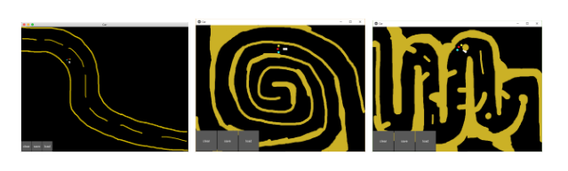

# Self-Driving Car AI
Welcome to the Self-Driving Car AI project! This README provides a brief overview of what the project does, the technologies it uses, and how to set it up and run.

## What It Does
This project simulates a self-driving car using Deep Q-Learning (DQN) to navigate through an environment. The AI learns to avoid obstacles and reach a goal by optimizing its actions based on rewards.

## How It Works

### Core Components
Neural Network (PyTorch): A simple feedforward neural network with two layers that predicts the best action for the car to take.
Experience Replay: Stores past experiences and samples them to train the neural network, improving learning stability and efficiency.
Deep Q-Learning: A reinforcement learning algorithm that updates the neural network based on rewards received from the environment.

### Technologies and Libraries
Python: Main programming language.
PyTorch: For building and training the neural network.
Kivy: For creating the graphical user interface and simulation environment.
NumPy: For numerical operations.
Matplotlib: For plotting performance graphs.

## Setup and Running
### Prerequisites
Make sure you have Python installed, then install the required libraries:

pip install numpy torch matplotlib kivy

### Running the Simulation
Clone the Repository:

git clone github.com/tichytomas/Self-Driving-Car
cd .../Self-Driving-Car

Run the Simulation:

python main.py

## Interacting with the Simulation
Drawing Obstacles: Use the mouse to draw obstacles on the simulation map.
Controlling the Car: The car navigates autonomously, learning from its interactions with the environment.
Buttons:
Clear: Clears the drawn obstacles.
Save: Saves the current state of the AI.
Load: Loads a previously saved state of the AI.
